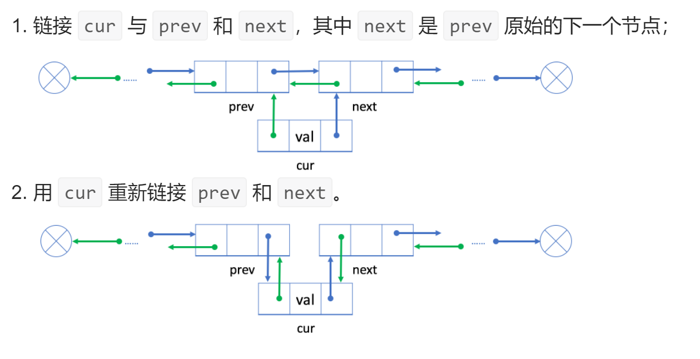
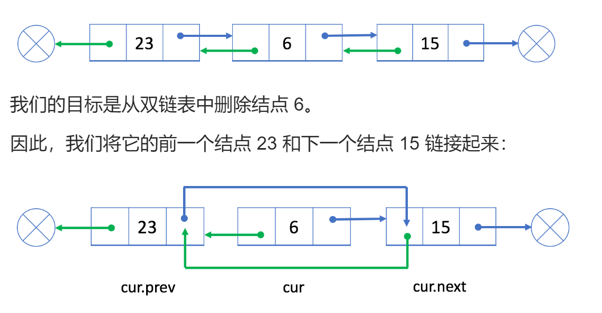

# 双向链表

每个节点有 `pre next` 两个指针


# 操作

## 插入节点

插入节点分为两步：

- 用`current`节点连接前后两个节点
- 前后两个节点改变`pre`、`next`指针指向`current`节点

> 首尾节点的插入只需要加入dummy节点即可与普通节点相同



```
1. cur节点去连接前后两个节点
	cur -> Next = prev -> Next
	cur -> pre  = prev
2.用前后节点去连接cur节点
	prev -> Next -> pre = cur 
	prev -> Next = cur
```


## 删除节点

```
A -> next -> pre = A // 将cur后面节点的pre指向A节点
A -> next = cur -> next //A节点Next指针指向cur后面节点
```




# 实现

- 与单链表题目相同

[题目来源](https://leetcode-cn.com/leetbook/read/linked-list/fabl3/)


## 全部代码

```go
// 节点结构体
type Node struct {
    Val int
    Next *Node
    Pre *Node
}

// 链表对象
type MyLinkedList struct {
    DummyHead *Node
    DummyTail *Node
    Size int
}

// 创建一个有虚拟首尾节点的链表
func Constructor() MyLinkedList {
    dummyHead := &Node{-1,nil,nil,}
    dummyTail := &Node{
        Val : -1,
        Next : nil,
        Pre : dummyHead,
    }
	dummyHead.Next = dummyTail //指向尾结点
    return MyLinkedList{dummyHead, dummyTail, 0}
}

// 获取index节点
func (this *MyLinkedList) Get(index int) int {
    if index >= this.Size || index < 0 {
        return -1
    }else {
        p := this.DummyHead
        for i := 0; i <= index; i++ { //找到的是index节点
            p = p.Next
        }
        return p.Val
    }
}

// 在头结点前面添加一个节点成为新的头节点
func (this *MyLinkedList) AddAtHead(val int)  {
    // 直接在dummyHead后面添加一个节点即可
    var newNode *Node = &Node{val, nil, nil,}
    // 后插法添加节点
    newNode.Next = this.DummyHead.Next// newnode指向前后两个节点
    newNode.Pre = this.DummyHead
    this.DummyHead.Next.Pre = newNode// 前后两个节点指向newNode
    this.DummyHead.Next = newNode
    this.Size++
}

// 在尾结点后面添加一个节点
func (this *MyLinkedList) AddAtTail(val int)  {
    // 在DummyTail前面添加一个节点
    var newNode *Node = &Node{val, nil, nil}
    // 前插法添加节点
    newNode.Next = this.DummyTail// newnode指向前后两个节点
    newNode.Pre = this.DummyTail.Pre
    this.DummyTail.Pre.Next = newNode// 前后两个节点指向newnode
    this.DummyTail.Pre = newNode
    this.Size++
}

// 在指定位置位置插入一个节点
func (this *MyLinkedList) AddAtIndex(index int, val int)  {
    if index > this.Size {
        return
    }else if index < 0 {
        this.AddAtHead(val)
    }else{
        // 找到索引为index.Pre的节点
        p := this.DummyHead
        for i := 0; i < index; i++ {
            p = p.Next
        }
        // 在index节点处插入
        var newNode *Node = &Node{Val: val, Pre: p, Next: p.Next, }
        p.Next.Pre = newNode
        p.Next = newNode
        this.Size++
    }
}

// 删除指定index的节点
func (this *MyLinkedList) DeleteAtIndex(index int)  {
    if index >= this.Size || index < 0 {
        return
    }else {
        p := this.DummyHead
        for i := 0; i < index; i++ { //找到的是index-1节点
            p = p.Next
        }
        p.Next.Next.Pre = p
        p.Next = p.Next.Next
        this.Size--
    }
}

```

测试

```go
func main() {
	list := Constructor()
	list.AddAtHead(1)
	list.AddAtTail(999)
	list.AddAtIndex(-1, 0)
	list.AddAtIndex(999, 998)
	list.AddAtIndex(2, 2)
	fmt.Println(list.Size,"\n", list.DummyHead.Next.Val, list.DummyTail.Pre.Pre.Val)
	fmt.Println(list.Get(0), list.Get(1), list.Get(2), list.Get(3))
}

----------输出
4 
 0 2
0 1 2 999
```

