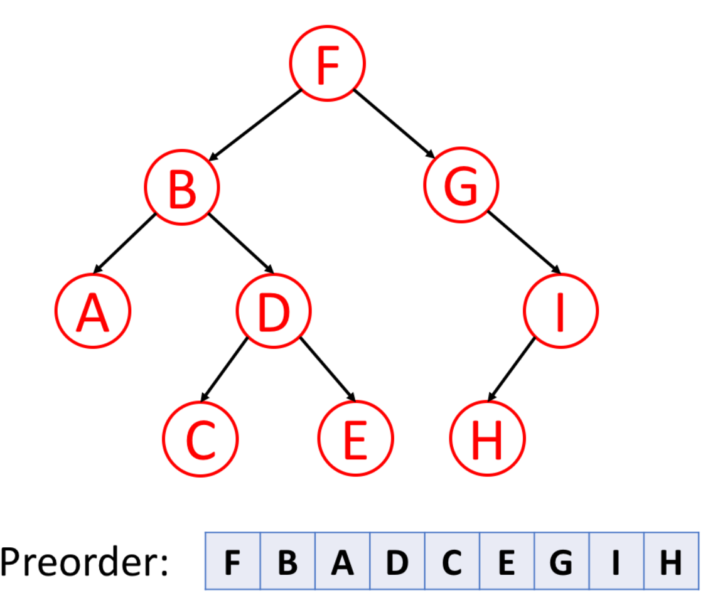
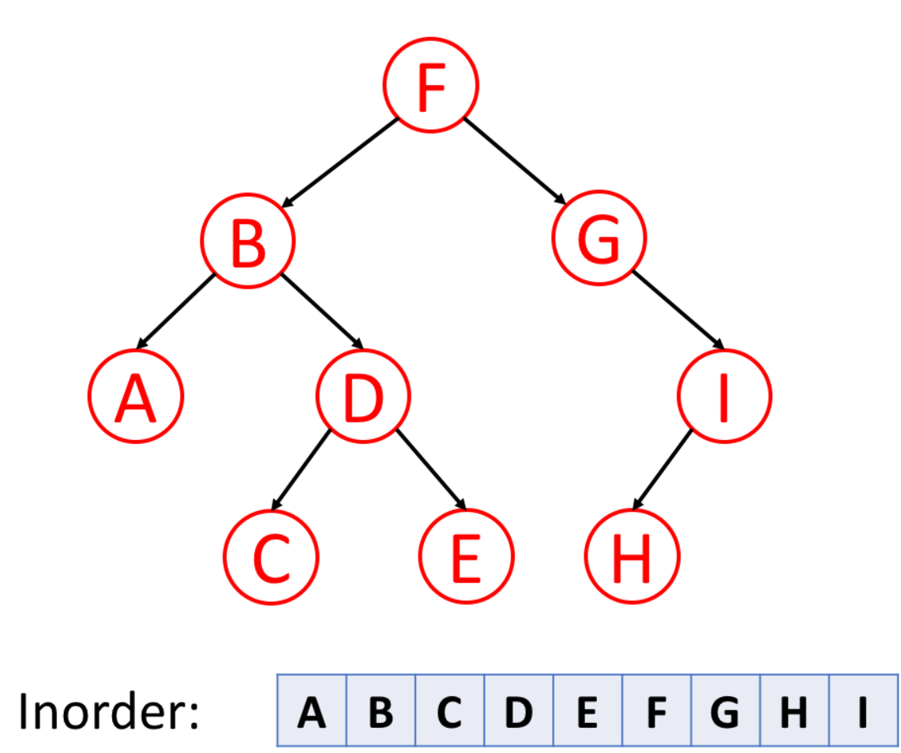
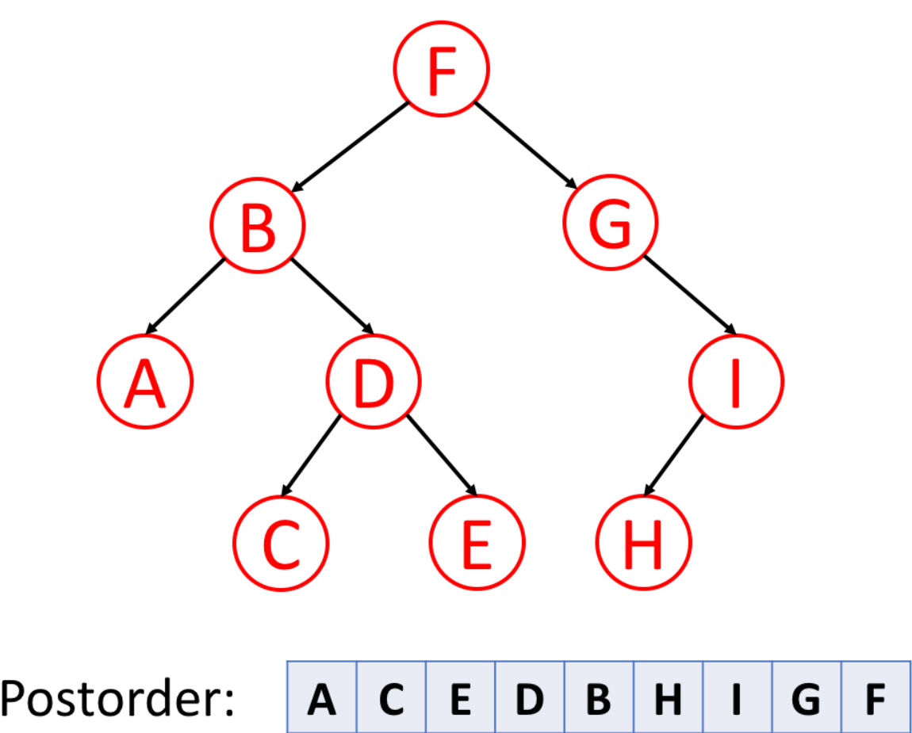
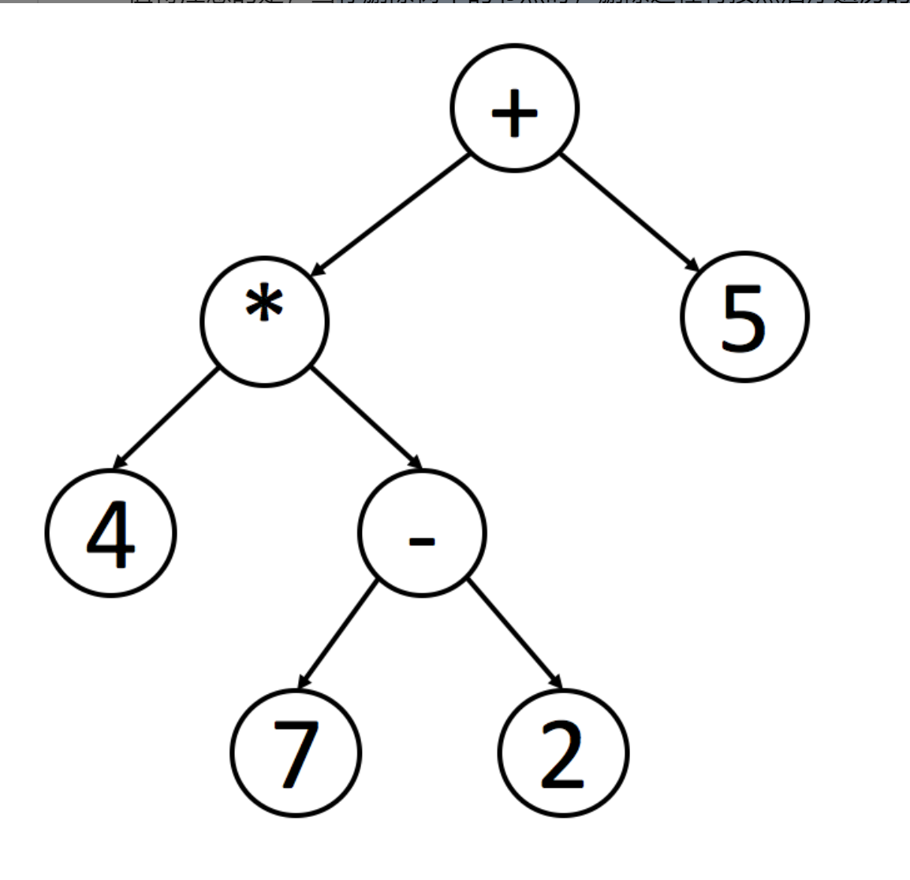

# 树的遍历

某序遍历：是指最先（前中后）遍历根节点

## 前序遍历

1. 根节点 2. 左子树 3. 右子树

## 中序遍历

1. 左子树 2. 根节点 3. 右子树

## 后序遍历及用处

1. 左子树 2. 右子树 3. 根节点

#### 删除节点

当要删除树中的节点时，需要采用后序遍历删除。

因为，要删除一个节点，需要先删除其左节点，再删除其右节点才能删除

#### 数学表达式

- 中序遍历可以让表达式成为人可以识别的表达式
- 后序遍历适合计算机编程处理

[文章来源](https://leetcode-cn.com/leetbook/read/data-structure-binary-tree/xe17x7/)

