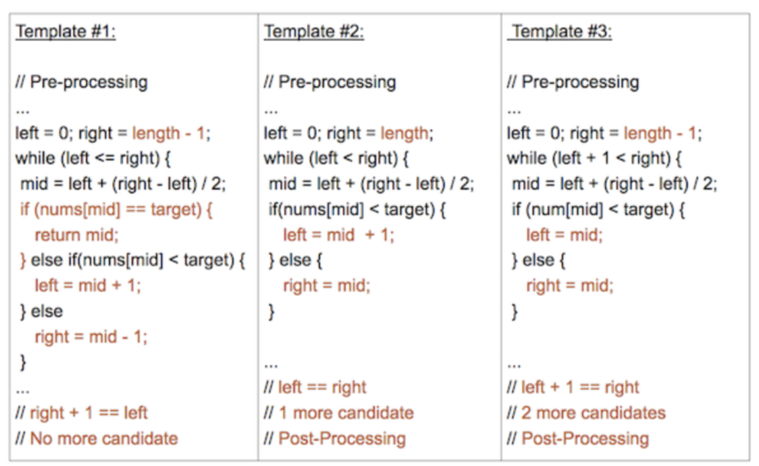

## 三个模板语法：

- **模板1**

   初始条件：`left = 0, right = length-1`
   终止：`left > right`
   向左查找：`right = mid-1`
   向右查找：`left = mid+1`

- **模板2：**

   初始条件：`left = 0, right = length` //不一定非要是right = length , length - 1也可以
   终止：`left == right` ： 保证查找区间有2个数
   右查找：`left = mid+1`
   向左查找：`right = mid`

- **模板3：**

   初始条件：`left = 0, right = length-1`
   终止：`left + 1 == right` ： 保证查找区间有3个数
   向左查找：`right = mid`
   向右查找：`left = mid`

## 三个模板的代码区别？

**主要区别：**

- **1: 为什么左右边界的取值要这么取?**

   - 模板1  `left = mid + 1` mid被排除在外， 每一步中都在判断mid是否符合条件，因此一旦进入左右区间，mid都是不符合条件的所以排除。

   - 模板2 `right = mid, left = mid+1`  因为模板2适用于mid 已经部分符合条件的情况下，查找有没有更优解。

      1. **举例**：在升序数组中查找大于 target 的最小数。每次直接判断mid是否大于target 即可，当mid > target时， mid可能是最终答案也可能不是，因此转向左区间 `right = mid` 继续寻找时候不能舍弃mid

      2. 具体例子如题目：猜错误版本、[搜索旋转数组最小值模板2解法](https://leetcode-cn.com/problems/find-minimum-in-rotated-sorted-array/solution/by-lin-xia-5-1jb9/)、寻找峰值(对应使用模板2的方法) 这三个题每次判断mid都只能将mid当成潜在结果值or mid不可能是答案

      3. 与模板1不同，模板1中mid的每次判断都可以确定mid是否为我们想要的值

   - 模板3  `left = mid, right = mid` 与上面模板二同理。题目如寻找峰值的模板3方法：

      [寻找峰值模板3解法](https://leetcode-cn.com/problems/find-peak-element/solution/by-lin-xia-5-q2j4/)

      [寻找峰值模板2解法](https://leetcode-cn.com/problems/find-peak-element/solution/by-lin-xia-5-q2j4/)

-  **2 : 终止循环的条件**
   - 模板1：`left <= right` : 因为区间内每个mid都可以直接判断， 因此当 right > left的时候 整个数组遍历完毕。完全消除每个数字
   - 模板2 : `left < right` : 为了始终保持区间内至少有2个数字 [left, right] ， 当`left = right`时 mid = left此时没有右邻居
   - 模板3 ： mid需要与左右邻居比较，因此当区间内值少于3个时跳出循环

## 三个模板在那种情况下使用？

- 模板1：mid直接就可以判断出是否为最终结果时。 如在有序数组中找一个target
- 模板2：mid需要与一个邻居相比较， 如 二分法迭代上坡的寻找峰值
- 模板3：mid需要与左右邻居相比较， 如 通过与左右邻居相比较寻找峰值

## 三个模板的后续处理区别？

- 模板1：不需要
- 模板2：for循环结束后需要确定最后一个数是否为我们所需 （left == right）
- 模板2：处理最后两个数字，如寻找峰值直到了边界剩下[......., 4, 5]需要判断最后的5是否为峰值 OR [2,1.......]需要判断2

