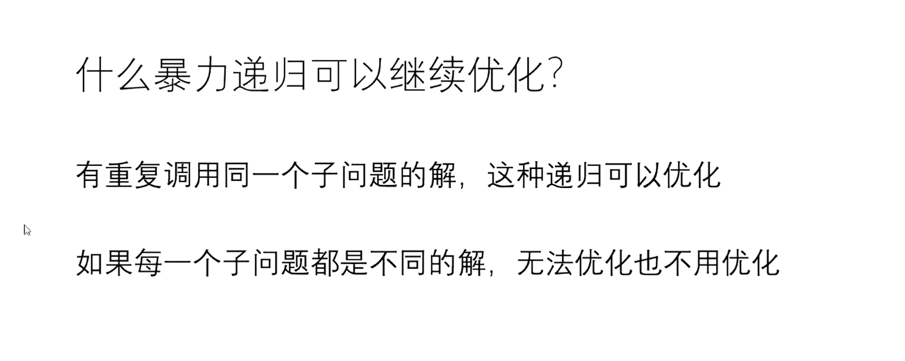
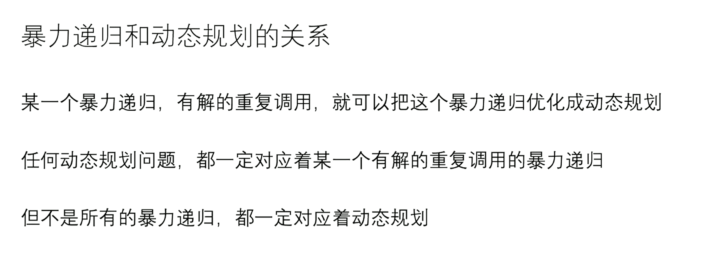
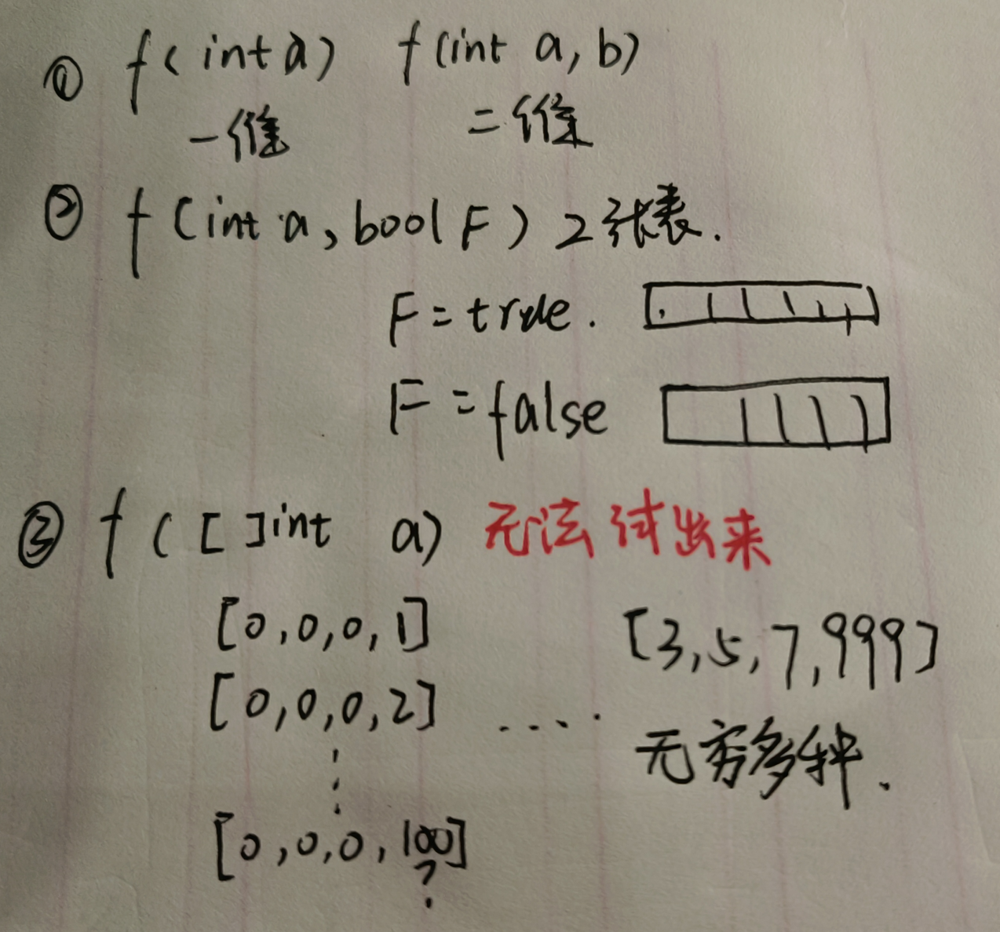

## 1 判断哪种暴力尝试更好

1. Process**可变参数**能少则少

   比如 process(arr, rest) 其中rest时可变的，可变参数为1个

   process(arr, num, rest) num,rest可变参数2个，相比之下选择上面的process方法更好

## 2 暴力递归在哪种情况下优化

## **3 如何找到一个问题的动态规划解法？**

1. 尝试设计暴力递归：原则 + 四种尝试模型
2. 分析暴力递归是否有重复解
3. 【傻缓存】对暴力递归使用记忆化搜索：
4. 【N维表】是否可以用N维表存储结果，从base case填好表，根据依赖关系填满表；
5. 【经典动态规划的优化】对于N维表，看是否有枚举行为，有进一步优化

#### 1) 设计暴力递归的原则

**1) 可变参数不要比int类型更复杂**

如果可变参数是int类型，int的变化范围就是 a, b。 可变参数为 (a, b)那么变化范围就是一个a * b 的表

如下，如果可变参数是`[]int a`那么有极其多种

**2）原则1如果违反，可变参数突破到了线性结构，那只能有一个可变参数**

比如上面的贴纸牌，**唯一**可变参数是rest，但rest的变化可以用**记忆化搜索**来记录。保证了rest的变化时一维线性结构

**3)如果违反1,不违反2， 则直接用记忆化搜索**

此时可变参数只有一个且突破了int类型， 则只能用记忆化搜索。 因为突破了int类型，那么他的N维表范围极大

**4)可变参数能少则少**

