# 一、贴纸牌

其中arr中的每种贴纸都有无穷多张

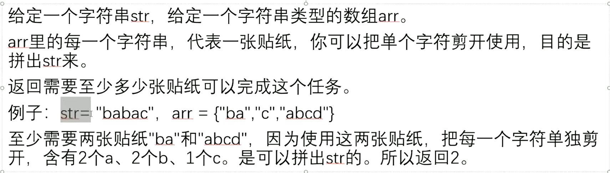

## 尝试

将str直接拆分并排序，

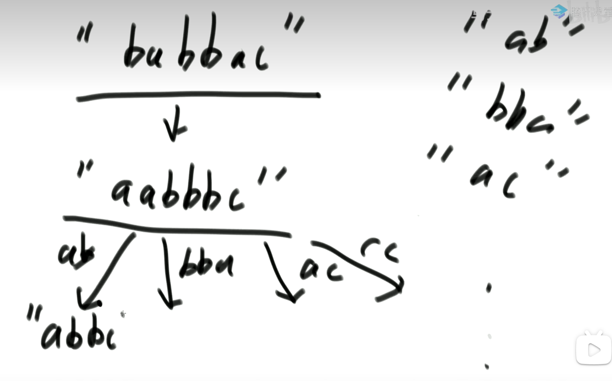

### **尝试的伪代码**

第一层尝试：第一层每个分支的张数不同，这一层最小的张数是Next。

- rest - first = nextRest， 这个分支下的张数是cur， 更新next，直到遍历完每个分支，找到最小的next值。

- 相当于DFS

**必须保证每张贴纸有必要试一试才去试**

**怎么都无法找到一张贴纸可以完成str的情况**

- 过滤：

   将arr中所有贴纸都拿出来，看是不是所有字符都能覆盖str的字母

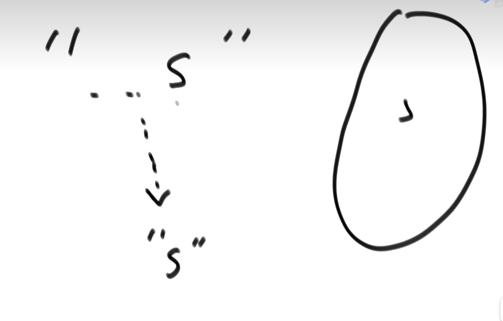

#### Map表示贴纸arr

如何表示arr贴纸数组：用 `[n][26]int` 表示arr

每张贴纸用一个26的数组表示，每个位置表示一个字母，数值表示这个字符出现了多少次。

比如 baabc = [2,2,1,......] a出现了2次，b出现了2次，c出现了1次

那么一共有N张贴纸，就有N个26长度的数组 

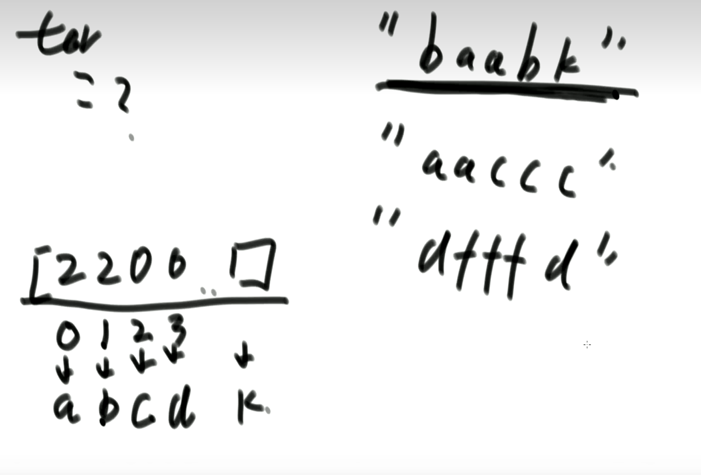

Map准备

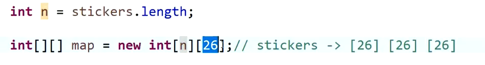

生成填充好的Map

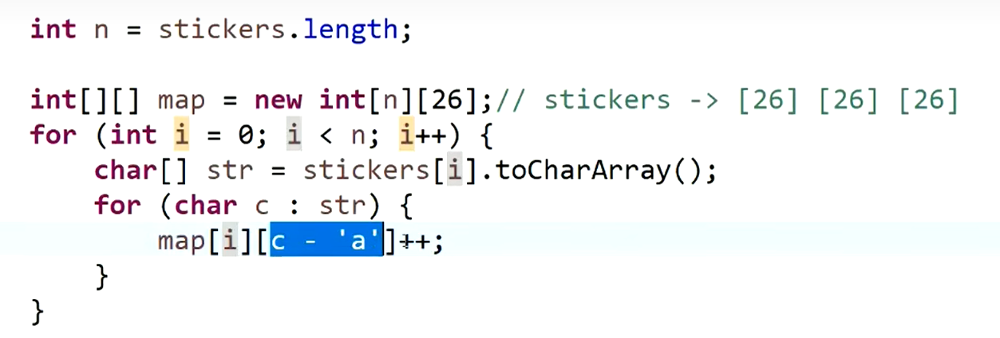

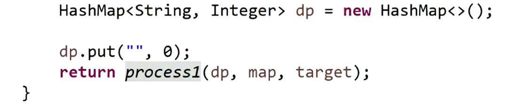

#### 过滤函数

#### 递归函数

傻缓存：将所有已经操作过得到答案的存到Map里，下次直接调用

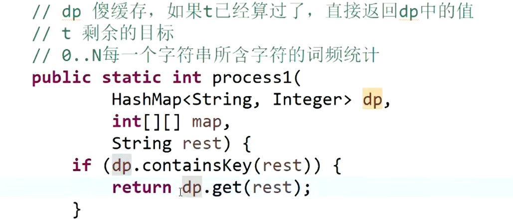

将每张贴纸and 剩余需要解决的str 转换成 词频统计数组

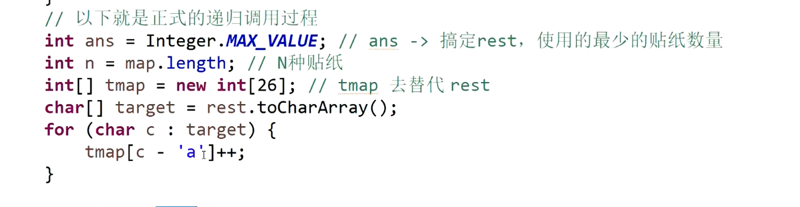

## 遍历尝试的实现

###### 1 rest-first=nextRest

如下：

Rest的词频数组， arr中第i张贴纸的词频数组。

当用第i个贴纸去尝试rest时， 直接用：rest的词频数组 - 贴纸词频数组 = nextRest(下一次要使用的词频数组)

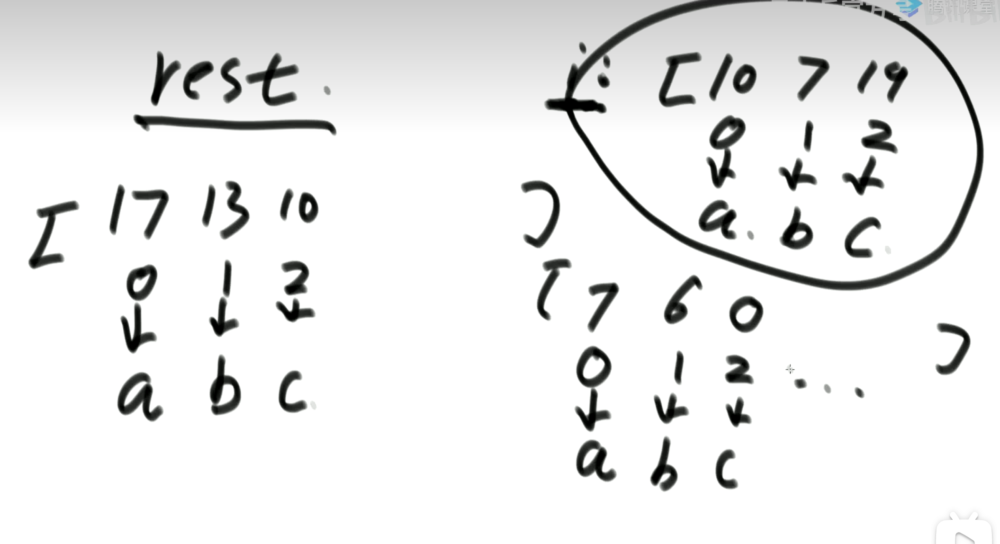

相当于上面伪代码中的减法【rest - arr[i] = nextRest 】

如上rest[0] - `arr[i][0]` = 7 ， 经过了第i号贴纸rest中的a从原来的17个变成现在只有7个。

下面代码就是在构造 nextRest，从空白到add7个a, 以后再将构造好的nextRest传入到下一轮的递归中去

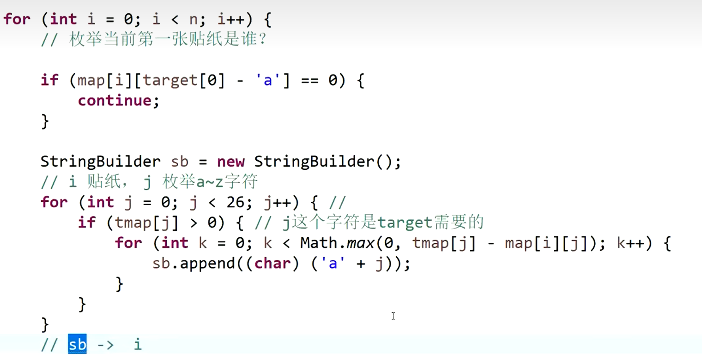

###### 2 cur = process(nextRest, arr)

###### 3 next = min(next, cur)

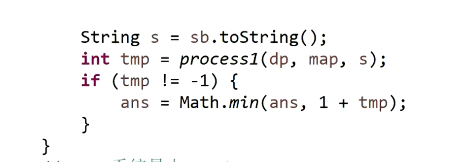

###### 4 更新傻缓存

 如果tmp从来没有更新：arr贴纸中每一张作为第一张贴纸tmp都=-1，都无法满足实现rest，因此整个arr数组无法搞定str

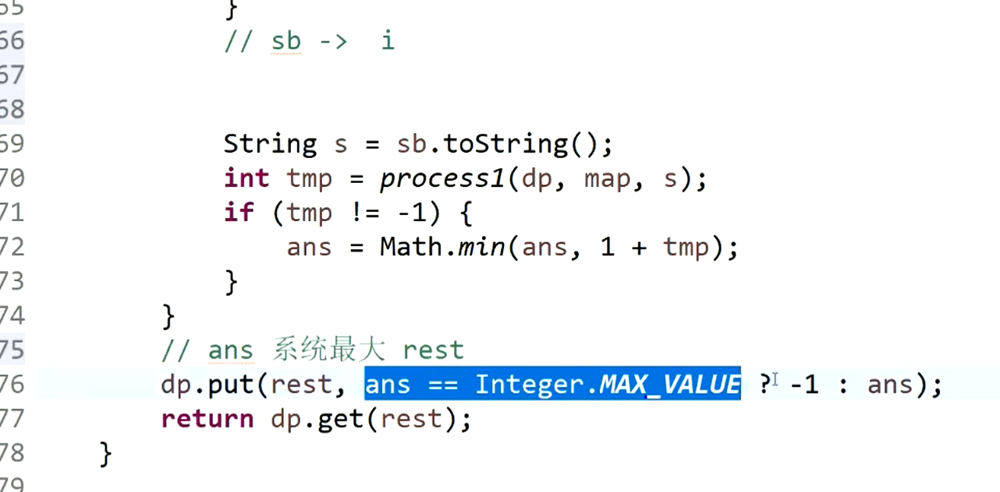

###### 保证本贴纸有效，会让str有变化

贴纸中必须包含一种str里面的字符，否则这个贴纸试了也是让str没有任何变化，反而还要不断地让一个没有变化的str不断地递归

比如 str = ABC arr[i] = 'xyz', 那么每次不断尝试arr[i] str都没有变化

下面说明：当前贴纸i，不具有target[0]位置的字符。

那么继续试下一张，如果所有贴纸都试玩了一遍，都不具有target[0]位置的字符，说明整个arr中都没有target[0]位置的字符

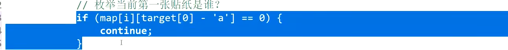

# 全部代码

