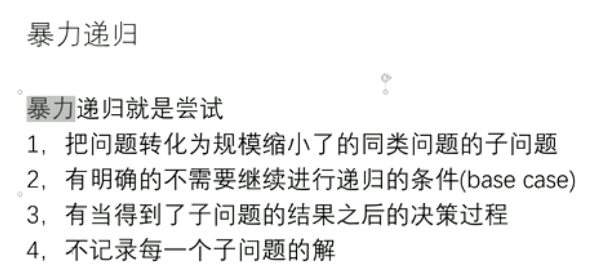
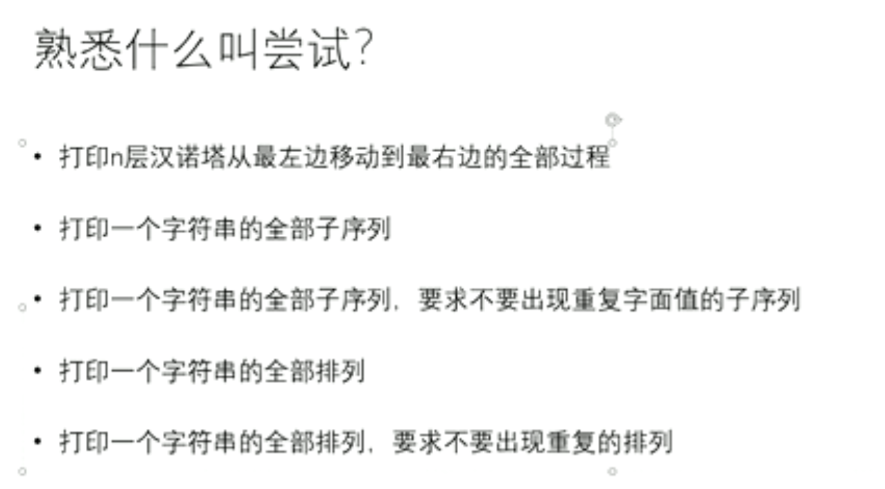
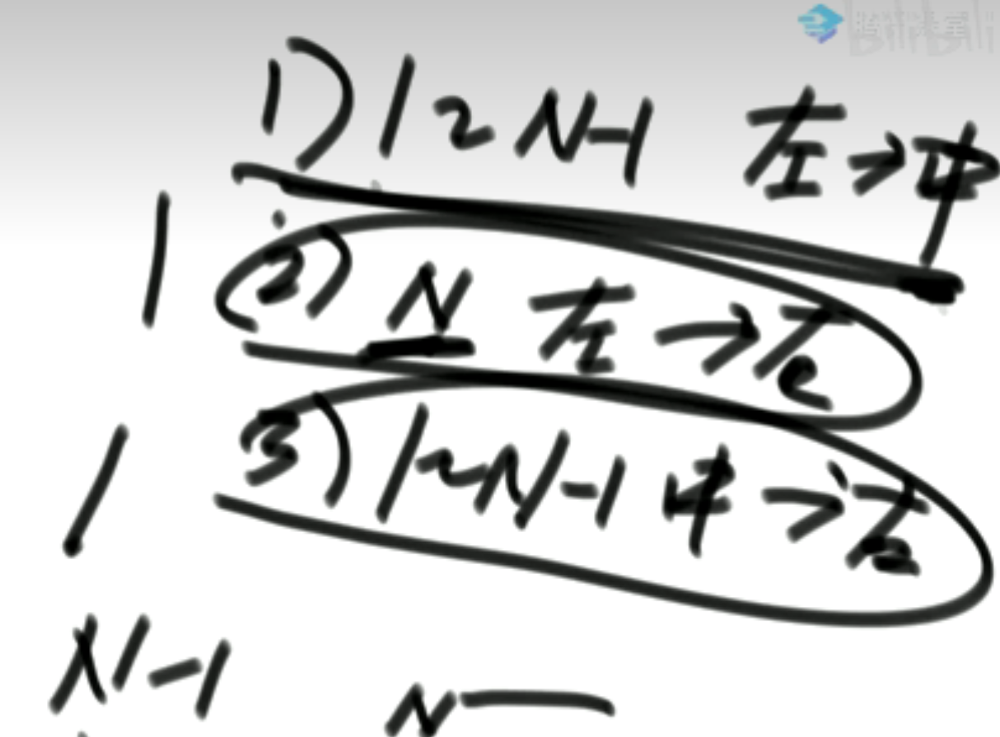
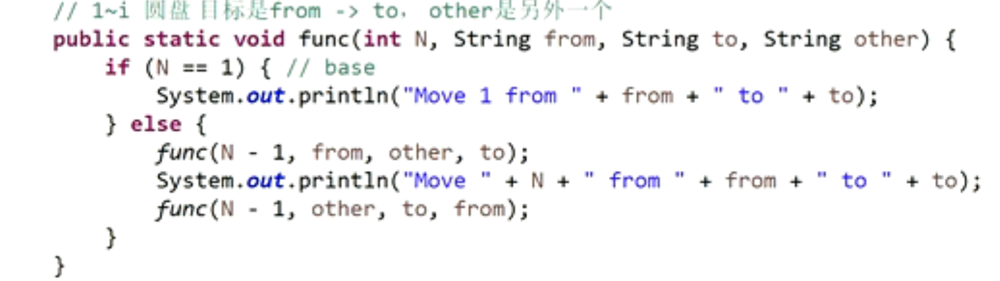
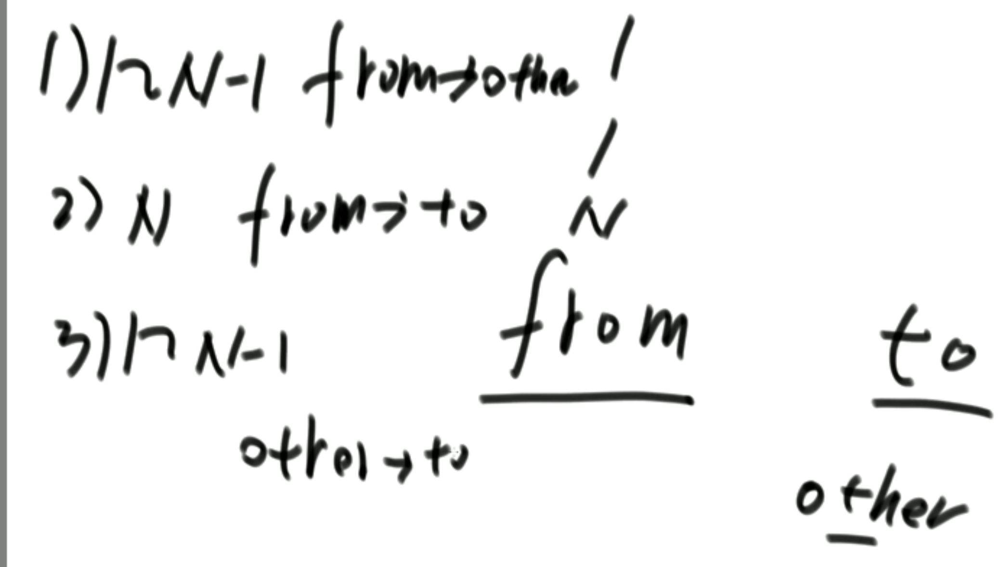
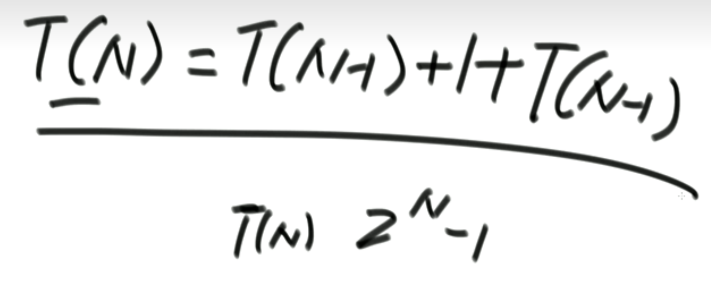
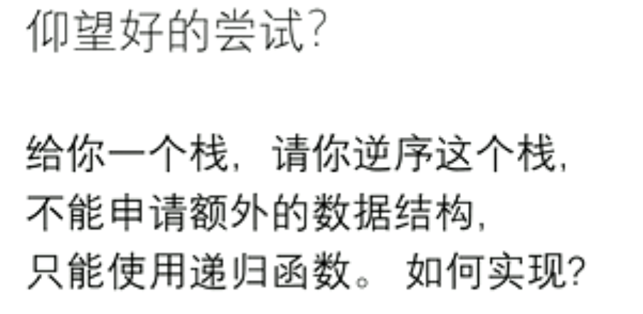

[toc]


# 暴力递归

递归就是尝试

暴力就是不记录每个子问题的解




## 尝试：

> 举例说明什么叫做尝试？



### 1 汉诺塔问题

有三根等边三角形的汉诺塔，如何将罗列好在1号柱子上的圆盘全部按照规定移动到3号柱子上。


**题目背景说明**

- 规定只能小盘子压大盘子，即使在移动过程中也是； 
- 有三个汉诺塔杆，他们像等边三角形一样站立
- 移动时盘子可以从1号杆到2号、3号任意位置：三根杆子之间盘子的移动没有限制

#### 1.1 思路

**左中右三根柱子的移动方法**：

1. 黑盒1（一大步）： `1-N-1` 个盘子全部移动到2号柱

2. （一小步）：第N个盘子直接从1号柱移动到3号柱

3. 黑盒2（一大步）：1-N-1个盘子全部从2号柱移动到3号柱




**通用的思路**：

> 上面有两个黑盒，但为了实现方便，需要摒弃掉左中右, 把中左右当做参数，最后只写一个黑盒(函数)

将所有圆盘从`from柱子`移动到`to柱子`

1）1-N-1 ： from -> other

2) N: from -> to

3)1-N-1: other -> to






#### 1.2 伪代码

下面精妙之处在于：  不断变换初始柱子，整个函数可重用

```go
// from: 圆盘初始位置； to：圆盘目的柱子； other：需要借助的空柱子
// num:需要移动的盘子个数
func Move(from string, to string, other string, num int) {
   1. if from柱子 上只剩一个圆盘
   	将圆盘直接从from柱移动到To柱
   	return
   2. else from柱子上有num个盘子{
      将num-1个盘子从from移动到other: Move(from, other, to, num-1)
      将num号盘子从from移动到to: print(将num从from移动到to上)
      将num-1个盘子从other移动到to:Move(other, to, from, num-1)
   }
}
```


#### 1.3 实现

```go
func Move(from, to, other string, num int) {
	if num == 1 {
		fmt.Printf("将1从%s移动到%s\n", from, to)
		return
	}
	Move(from, other, to, num-1)               //将num-1个盘子从from移动到other
	fmt.Printf("将%d从%s移动到%s\n", num, from, to) //将num号盘子从from移动到to
	Move(other, to, from, num-1)               // 将num-1个盘子从other移动到to
}
func main() {
	Move("Left", "Right", "Mid", 3)
}
```

**输出**

```go
将1从Left移动到Right
将2从Left移动到Mid
将1从Right移动到Mid
将3从Left移动到Right
将1从Mid移动到Left
将2从Mid移动到Right
将1从Left移动到Right
```

#### 1.4 结论

N层汉诺塔移动的次数一定是 2^n - 1 步。 

比如3层汉诺塔移动次数是7次




#### 1.5 LeetCode题目

[力扣的汉诺塔问题](https://leetcode.cn/problems/hanota-lcci/)


###### 1）实现难点

1. 题目中ABC三根柱子是用slice实现的，slice的内存特点是无法删除元素，只能覆盖。

   比如当slice只有一个元素，删除slice尾部元素：

```go
不能使用：slice = []int{}
而要使用：slice = slice[:-1] or slice = slice[:len(slice)-1]
```

2. A B C三根柱子在`move`函数中要使用**引用传递**，或者不断更新ABC三根柱子的情况。（一开始没有注意到这个问题，导致ABC三根柱子没有更新）

###### 2）实现代码

```go
func hanota(A []int, B []int, C []int) []int {
	if len(A) == 0 {
		return A
	}

	// Move：移动ABC， 保证ABC的全局性改变
	var move func(from, to, other *[]int, n int)
	move = func(from, to, other *[]int, n int) {
		// 1. 如果from只有一个盘子，直接移动到To
		if n == 1 { //终止条件
			*to = append(*to, (*from)[len(*from)-1])
			*from = (*from)[:len(*from)-1]
			// slice原来的元素始终都在原来的内存空间，因此想要删除元素只能：覆盖并输出前面需要的数据
			fmt.Println("此时的from = ", from)
			return
		}
		// 2. 如果有N个：
		// 	1. 将N-1一个圆盘移动到other
		move(from, other, to, n-1)
		// 	2. 将第N个从from移动到To
		*to = append(*to, (*from)[len(*from)-1])
		*from = (*from)[:len(*from)-1]
		// 	3. 将N-1个从other移动到To
		move(other, to, from, n-1)
		// 	完成全部移动
	}
	move(&A, &C, &B, len(A)) // 将A中的盘子都移动到C
	return C
}
```


### 2 逆序一个栈




#### 2.1 抽象思路

step 1： `F(stack) int`创建一个函数 : 函数功能是去掉栈底元素并返回栈底元素;但整个stack保持不变

​	

step 2:`Reverse(stack)` 功能: 借用F(stack)逆序栈中所有元素

​	栈不为空时，通过F(stack)去掉最后一个元素，并获得这个元素last; 

​	重复调用Reverse： 再借用F(stack)获取此时stack中的栈底元素，并将此时last元素压入栈中，直到stack中没有元素

​	将last元素压入栈中;

​	

#### 2.2 伪代码

**F(stack) int 实现**

> 1. Pop栈顶元素；
>
> 2. 如果此时栈空，则返回Pop元素
>
> ​	如果栈不空，则：
>
> ​		继续删除栈底元素：result = F(stack)
>
> ​		并将前面弹出的元素压入栈中：push(Pop)
>
> ​		返回result

**Reverse(stack)实现**

>1. stack不空：获取并去掉栈底元素 last := F(stack)
>
>2. Reverse(stack):继续去掉栈底元素
>3. 将last元素压入栈中


#### 2.3 具体实现


```go
package main

import (
    "fmt"
)

// 逆序函数

// F函数

func Reverse(stack []int) {
    // F函数
    var F func() int
    F = func() int {
        // 1. 栈顶元素出栈
        top := stack[len(stack) - 1]
        stack = stack[:len(stack) - 1]
        
        // 2. 如果栈空则直接返回top元素：top就是栈底元素
        if len(stack) == 0 {
            return top
        }else {
            result := F()// 3.1继续获取栈底元素
            stack = append(stack, top)//3.2top元素重新入栈
            return result//3.3返回被删除的栈底元素
        }
    }
    
    
    if len(stack) == 0 {
        return
    }
    i := F()// 1. 获取栈底元素
    fmt.Println("获取last元素：i=", i)
    Reverse(stack)// 2. 继续将所有栈底元素抽取出来
    stack = append(stack, i)// 3. last元素入栈
    fmt.Println("最后一个元素入栈：stack=", stack)
}
func main() {
    stack := []int{1, 2, 3}
    fmt.Println("逆序前的Stack: ", stack)
    Reverse(stack)
    fmt.Println("逆序后的Stack: ", stack)
}
```

**输出**

```go
逆序前的Stack:  [1 2 3]
获取last元素：i= 1
获取last元素：i= 2
获取last元素：i= 3
最后一个元素入栈：stack= [3]
最后一个元素入栈：stack= [3 2]
最后一个元素入栈：stack= [3 2 1]
逆序后的Stack:  [3 2 1]
```


### 递归的总结

将1个大问题拆成同样含义的子问题

不断的尝试


# 参考链接

[左程云算法教学视频](https://www.bilibili.com/video/BV1Ef4y1T7Qi?p=13&vd_source=47272764e1eb400edc65776bfe6a48af)