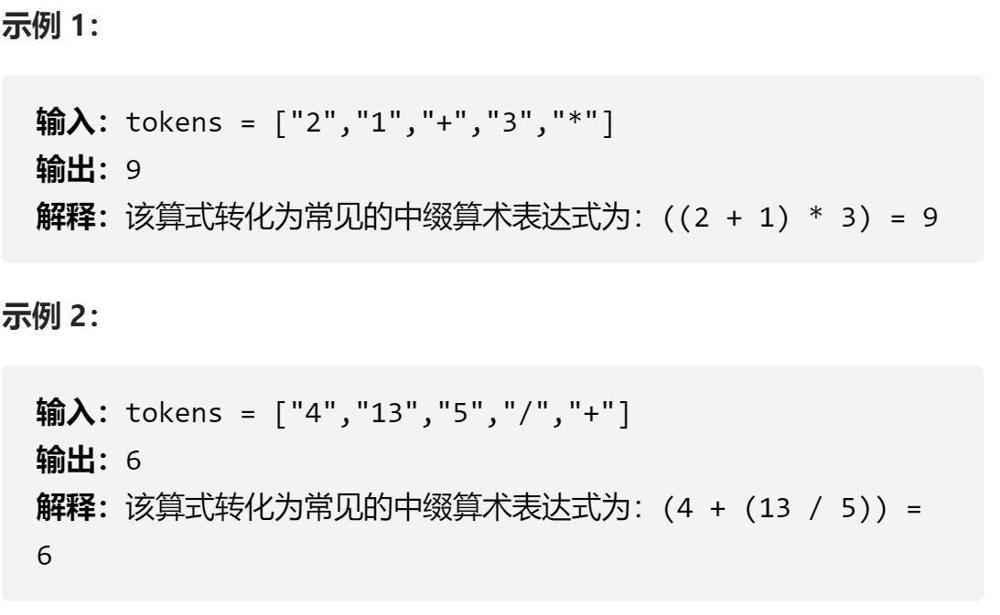
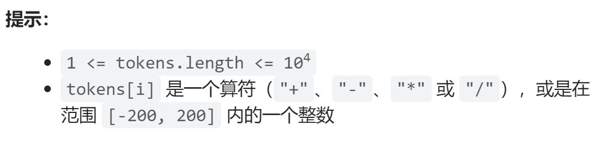
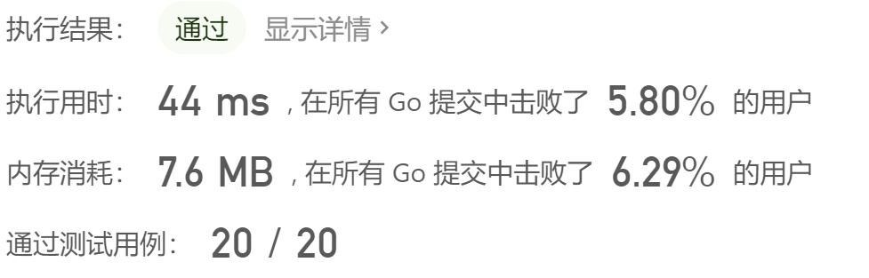

#### [逆波兰表达式求值](https://leetcode-cn.com/problems/evaluate-reverse-polish-notation/)




# 题解


### 方法一:使用栈

    遇到数字就入栈
    遇到运算符就：将栈顶两个数字进行运算符操作
    计算结果直接入栈
    
    当全部运算结束，最终的答案将会是在栈内唯一元素，直接返回stack[0]
伪代码

```go
for tokens {
    if 数字 {
        入栈
    }else { 运算符
        num1:栈顶元素Pop
        num2:栈顶元素Pop
        结果 = num1 token num2
        结果入栈
    }
}
return 栈顶元素
```


**代码**：**不同的实现方式**


###### 一：官方代码

- 用`result, err :=  strconv.Atoi(s string)` 来判断元素为数字or运算符
   - 将字符串转换成数字 , 如果成功则是数字
   - 失败则是运算符(仅限此题)

```go
func evalRPN(tokens []string) int { 
    stack := []int{}
    for _, tok := range tokens {
        result, err := strconv.Atoi(tok)
        if err == nil {
            stack = append(stack, result)
        }else { //运算符
            num1, num2 := stack[len(stack) - 1], stack[len(stack) -2]
            stack = stack[:len(stack) -2]// 运算数字出栈
            answer := 0
            switch tok {
                case    "+" :
                    answer = num2 + num1
                case "-" : 
                    answer = num2 - num1
                case "*" : 
                    answer = num2 * num1
                case "/" : 
                    answer = num2 / num1
            }
            stack = append(stack, answer) //结果入栈  
        }
    }
    return stack[0] //最终结果
}
```


###### 二: **我的代码**

使用正则表达式判断 元素是否为数字



```go
func evalRPN(tokens []string) int { 
    if len(tokens) == 1 { // tokens只有一个数字时
        num, _ := strconv.Atoi(tokens[0])
        return num
    }
    stack := []int{}
    for _, tok := range tokens {
        result, _ := regexp.MatchString(`^-?\b+`, tok) //判断是否全为数字，是则true
        if result{
            num, _ := strconv.Atoi(tok)
            stack = append(stack, num)
        }else { //运算符
            num1, num2 := stack[len(stack) - 1], stack[len(stack) -2]
            stack = stack[:len(stack) -2]// 运算数字出栈
            answer := Calculate(num1, num2, tok)
            stack = append(stack, answer) //结果入栈
        }
    }
    return stack[0] //最终结果
}

func Calculate(num1 , num2 int, tok string) int {
    if tok == "+" {
        return num2 + num1
    }
    if tok == "-" {
        return num2 - num1
    }
    if tok == "*" {
        return num2 * num1
    }
    if tok == "/" {
        return num2 / num1
    }
    return -9999
}
```

