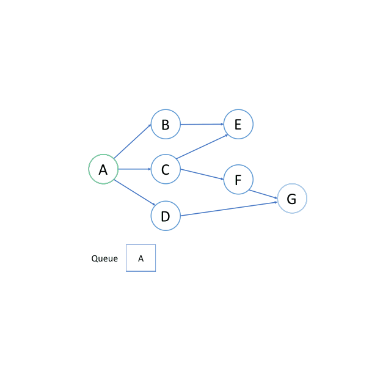

# **BFS**

广度优先遍历


## **寻找最短路径**

下面是使用BFS寻找从`A`到`G`的最短路径方法示例




[参考资料](https://leetcode-cn.com/leetbook/read/queue-stack/kyozi/)


### 实现

最短路径伪代码

```java
/**
 * Return the length of the shortest path between root and target node.
 */
int BFS(Node root, Node target) {
    Queue<Node> queue;  // store all nodes which are waiting to be processed
    int step = 0;       // number of steps neeeded from root to current node
    // initialize
    add root to queue;
    // BFS
    while (queue is not empty) {
        step = step + 1;
        // iterate the nodes which are already in the queue
        int size = queue.size();
        for (int i = 0; i < size; ++i) {
            Node cur = the first node in queue;
            return step if cur is target;
            for (Node next : the neighbors of cur) {
                add next to queue;
            }
            remove the first node from queue;
        }
    }
    return -1;          // there is no path from root to target
}
```


