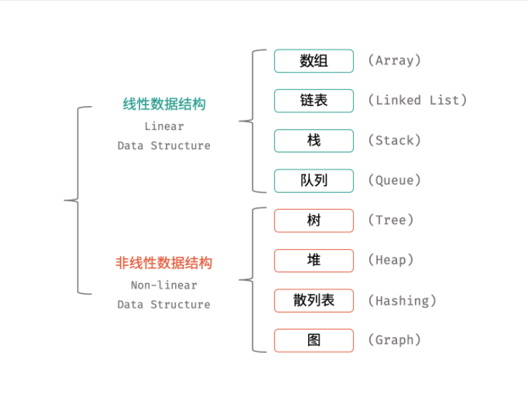
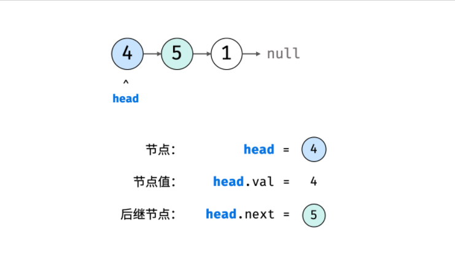

# 

看每一章节的时候再来看每种数据结构的实现




## 数组

**简介**：

- 数组是连续存储同类型元素的不可变的

- 用索引访问

- 元素内存地址连续


**Go实现**：

[菜鸟教程](https://www.runoob.com/go/go-arrays.html)

声明、赋值、访问

```go
   var n [10]int /* n 是一个长度为 10 的数组 */
   var i,j int

   /* 为数组 n 初始化元素 */        
   for i = 0; i < 10; i++ {
      n[i] = i + 100 /* 设置元素为 i + 100 */
   }

   /* 输出每个数组元素的值 */
   for j = 0; j < 10; j++ {
      fmt.Printf("Element[%d] = %d\n", j, n[j] )
```


## 链表

- 【节点】：值， 指向下一个节点的指针
- 【访问方式】：只能顺序访问



Go 实现：

[参考链接](https://learnku.com/articles/44998)

```go
// 节点
type Node struct {
   data int //  Data interface{} 具体的可以是int、float64...
   next *Node // 指针
}

// 创建链表
Node1 := Node{4}
Node2 := Node{5}
Node3 := Node{6}
// 构建链表指向
Node1.next = Node2
Node2.next = Node3
```


```go
package main

import (
    "fmt"
)

// 定义节点
type Node struct {
    Value int
    Next  *Node
}

// 初始化头节点
var head = new(Node)

// 添加节点
func addNode(t *Node, v int) int {
    if head == nil {
        t = &Node{v, nil}
        head = t
        return 0
    }

    if v == t.Value {
        fmt.Println("节点已存在:", v)
        return -1
    }

   // 如果当前节点下一个节点为空
    if t.Next == nil {
        t.Next = &Node{v, nil}
        return -2
    }

   // 如果当前节点下一个节点不为空
    return addNode(t.Next, v)
}

// 遍历链表
func traverse(t *Node) {
    if t == nil {
        fmt.Println("-> 空链表!")
        return
    }

    for t != nil {
        fmt.Printf("%d -> ", t.Value)
        t = t.Next
    }

    fmt.Println()
}

// 查找节点
func lookupNode(t *Node, v int) bool {
    if head == nil {
        t = &Node{v, nil}
        head = t
        return false
    }

    if v == t.Value {
        return true
    }

    if t.Next == nil {
        return false
    }

    return lookupNode(t.Next, v)
}

// 获取链表长度
func size(t *Node) int {
    if t == nil {
        fmt.Println("-> 空链表!")
        return 0
    }

    i := 0
    for t != nil {
        i++
        t = t.Next
    }

    return i
}

// 入口函数
func main() {
    fmt.Println(head)
    head = nil
    // 遍历链表
    traverse(head) 
    // 添加节点 
    addNode(head, 1)
    addNode(head, -1)
    // 再次遍历
    traverse(head)
    // 添加更多节点
    addNode(head, 10)
    addNode(head, 5)
    addNode(head, 45)
    // 添加已存在节点
    addNode(head, 5)
    // 再次遍历
    traverse(head)

   // 查找已存在节点
    if lookupNode(head, 5) {
        fmt.Println("该节点已存在!")
    } else {
        fmt.Println("该节点不存在!")
    }

   // 查找不存在节点 
    if lookupNode(head, -100) {
        fmt.Println("该节点已存在!")
    } else {
        fmt.Println("该节点不存在!")
    }
}
```


## 栈


## 队列

